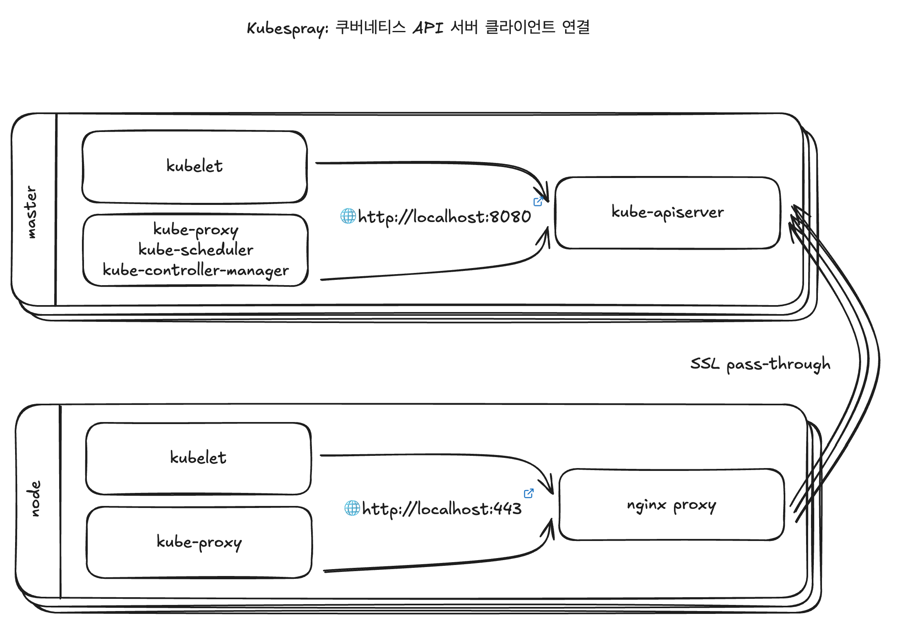

# 2.4 쿠버네티스 클러스터를 직접 구성하는 도구

## 2.4.1 Kubeadm

- 쿠버네티스에서 공식 제공하는 클러스터 생성/관리 도구
- 초기에는 고가용성(HA, High Availability)을 갖춘 클러스터를 구성하기 어려워 테스트용 클러스터 구성에 주로 사용
- 최근에는 고가용성을 제공하는 클러스터까지 구성할 수 있음

 

### 클러스터 고가용성 구조

- 여러 대의 마스터 노드 구성
- 그 앞에 로드밸런서 구성
- 워커 노드들이 로드밸런서를 통해 마스터 노드에 접근
- 마스터 노드 1대에 장애가 발생하더라도 로드밸런서에서 다른 마스터 노드로 접근할 수 있게 해서 클러스터의 신뢰성을 유지

 

## 2.4.2 Kubespray

- 상용 서비스에 적합한 보안성과 고가용성이 있는 쿠버네티스 클러스터를 배포하는 오픈소스 프로젝트
- 서버 환경 설정 자동화 도구인 "앤서블(Ansible)"을 기반으로 개발
- 설정에 따라 사용자에게 맞는 다양한 형식으로 쿠버네티스 클러스터를 구성할 수 있음
  - 온프레미스 환경에서 상용 서비스의 쿠버네티스 클러스터를 구성할 때 유용
- 설치 이후에 다음과 같은 추가 구성 요소를 클러스터에 실행하는 역할도 함
  - ingress-nginx controller
  - helm
  - volume plugin
  - cephfs-provisioner
  - cert-manager (SSL 인증서 관리)

 

### 클러스터 고가용성 구조

- 별도의 로드밸런서를 사용하지 않음
- 노드 각각의 nginx가 리버스 프록시로 실행됨
- 이 nginx-proxy가 전체 마스터 노드를 바라보는 구조
- 쿠버네티스의 컴포넌트들은 직접 마스터 노드와 통신하지 않고 자신의 서버 안 nginx와 통신

 

### 플러그인

- 쿠버네티스는 CNI(Container Network Interface) 를 만족하는 다양한 네트워크 플러그인 지원
- Kubespray를 이용하면 간단한 설정으로 클러스터 네트워크를 자동 구성할 수 있음
- Kubespray(v2.11)가 지원하는 네트워크 플러그인
  - flannel (플라넬)
  - calico (칼리코)
    - BGP(layer 3) 기반 네트워킹 지원
    - IPinIP 터널링 기능을 옵션으로 사용할 수 있음
    - Tigera(티제라)라는 회사의 주도로 개발
    - Kubespray의 기본 설정

 

## 노드

### 마스터 노드 (Master Node)

- 노드들의 상태를 관리하고 제어
- 쿠버네티스의 데이터 저장소로 사용하는 etcd를 함께 설치하거나 별도 노드에 분리해서 설치
- 마스터 노드를 1대만 설치할 수도 있지만 고가용성을 고려해 3대나 5대로 구성

 

### 워커 노드 (Worker Node)

- kubelet 이라는 프로세스(agent)가 동작
- 마스터 노드의 명령을 받아 사용자가 선언한 파드나 job을 실제 실행
